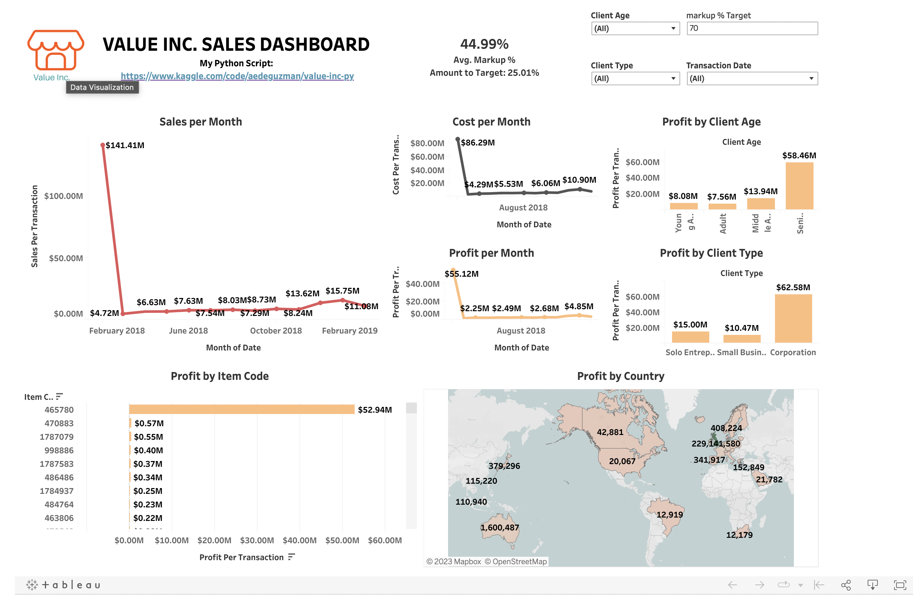
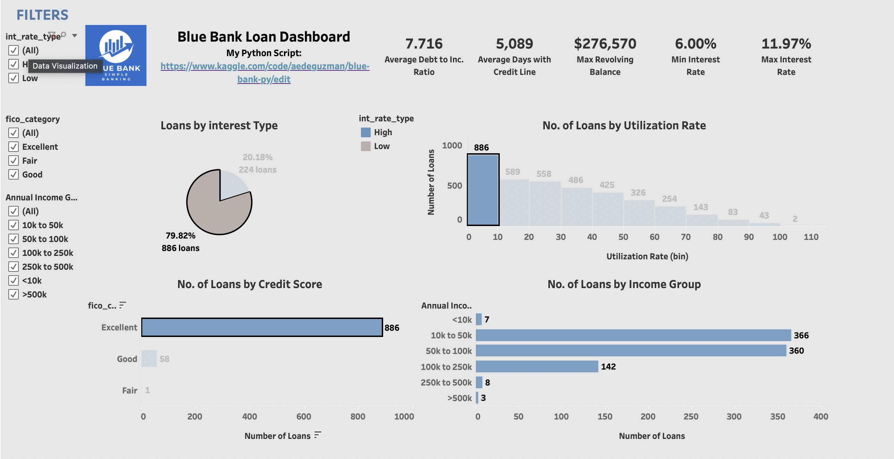
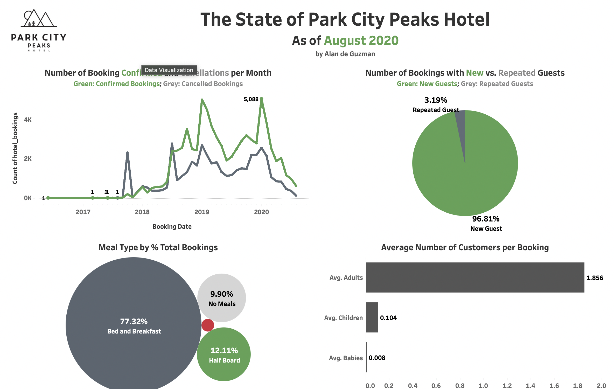

<h1 align="center">Hi 👋, I'm Alan</h1>
<h2 align="center">A passionate Data Analyst from the USA</h2>

- 🔭  I’m currently working on Data Analysis projects.

- 👨‍💻  I am currently learning Web Scraping and Python.

- 👯  I’m looking to collaborate more on open source.

- 💬  Ask me about my interests

- 😄  Fun Fact:  Tater Tot is short for potato toddler. 

 
 
<h2 align="center">⚡About Me⚡</h2>
 
As a Data Analyst, I am passionate about the world of data and its limitless potential to drive meaningful insights and informed decisions. With a strong educational background and a hunger for learning, I am eager to embark on my journey in the field of data analysis. I bring a fresh perspective and a commitment to mastering the latest tools and techniques in data science. 
 
My adaptability and problem-solving skills enable me to tackle complex data challenges and provide innovative solutions. 
I thrive in a dynamic and collaborative environment, where I can contribute my growing expertise in data manipulation, visualization, and statistical analysis. I am excited about the opportunities ahead and am dedicated to making a significant impact in the world of data analytics, helping organizations make data-driven decisions that lead to success and growth.
 
 

## 🌱Here's what I can do:🌱
 

 

 
 <b>•<b/> Communication <b>•<b/> Problem-Solving <b>•<b/> Analytical Thinking <b>•<b/> Data Visualization <b>•<b/> Teamwork
 
 

# ⚒️ What I've been working on: ⚒️
 
## Relational Database Analysis 
 
 

 
 
I utilized [SQL](Alan_MavenMovies_.sql) to delve into a comprehensive 16-table database of a company, employing various queries and commands to extract pertinent information. Through this exploration, I focused on understanding key aspects of our business operations, namely inventory, transactions, staff, and customers. By carefully crafting SQL queries, I retrieved and analyzed data sets that provided insights into inventory levels, transaction histories, staff performance metrics, and customer interactions. This analytical approach allowed me to uncover patterns, trends, and relationships within the database, ultimately contributing to a comprehensive understanding of this company's operations. 
 
 

 
## Data Visualization 
 
 

 
Tableau is my go-to tool for [data visualization](https://public.tableau.com/app/profile/aedeguzman/vizzes). It starts with importing data from various sources, such as spreadsheets, databases, or cloud services. Once the data is in, Tableau's user-friendly interface allows me to effortlessly create interactive charts, graphs, and dashboards. I can customize these visuals to tell a compelling data story, adjusting colors, labels, and interactivity to highlight key insights. Tableau's real-time data exploration features enable me to dive deep into the details or zoom out for a broader view, making it an indispensable tool for data analysis and reporting. Whether it's for business presentations, analytics, or uncovering trends, Tableau helps me unlock the power of data through visual representation.
 
 
***Value Inc. Sales Dashoard***
 
 

 
Welcome to the world of bulk household essentials  with [Value Inc.'s](https://public.tableau.com/app/profile/aedeguzman/viz/SalesperTransaction/ValueInc_Sales) comprehensive dashboard. Dive into the nitty-gritty of our operations with monthly sales and cost breakdowns, pinpointing profitability like never before. Explore the correlation between profit and client age, see which client types drive our success, and dive into the specifics of our top-performing items. Discover how our reach extends across borders with profit metrics by country. 
 
 
***Blue Bank Loan Analysis***
 
 

 
With [Blue Bank's](https://public.tableau.com/app/profile/aedeguzman/viz/LoansbyInterestType/BlueBankLoanDashboard) insightful dashboard, we offer a strategic lens into our lending operations. We've scrutinized the landscape of risk, examining loads by interest type, number of loans by credit utilization rate, credit score, and income group. By understanding the nuances of borrower behavior, we aim to identify and mitigate risks effectively, ensuring the financial well-being of both our clients and the bank. This dashboard embodies our commitment to responsible lending and financial stewardship.
 
 
***Park City Peaks Hotel***
 
 

  
Welcome to [Park City Peaks Hotel's](https://public.tableau.com/app/profile/aedeguzman/viz/ParkCity_16981168760140/HotelBookingsDashboard) dashboard, your window into our world of hospitality. Here, you'll find a snapshot of our performance and our guests' preferences. Discover the ebb and flow of bookings and cancellations, track the balance between new and returning guests, and determine our patrons’ savor. Additionally, get insights into whether our accommodations are primarily chosen by individuals or families. 
 
 

## VADER Sentiment Analysis
 

Employing [VADER Sentiment Analysis](https://github.com/aedeguzman/aedeguzman.github.io/blob/09b4b1ac90f05597b419e31bda490f8481787470/Sentiment%20Analysis.ipynb)on Amazon Fine Foods reviews provided a valuable means to gauge customer sentiments with precision. By utilizing this tool, I was able to quantitatively assess the polarity of reviews, distinguishing between positive, neutral, and negative sentiments. This analysis allowed me to gain deeper insights into customer satisfaction, identify areas for product improvement, and make data-driven decisions to enhance the Amazon Fine Foods product line.   

 
## Exploratory Data Analysis
 

Exploratory data analysis (EDA) played a pivotal role in uncovering valuable insights within the  [Roller Coaster Database](https://github.com/aedeguzman/aedeguzman.github.io/blob/main/Roller%20Coaster%20EDA.ipynb).  By visualizing and summarizing the dataset's key attributes, I gained a comprehensive understanding of how many roller coasters were built in which year,  as well as the materials the roller coaster were comprised of.  I also examined the relationships between the height of the coaster and its maximum speed.  EDA allowed us to identify trends, correlations, and outliers, enabling data-driven decisions to optimize ride experiences, and marketing strategies within the amusement park industry.      

